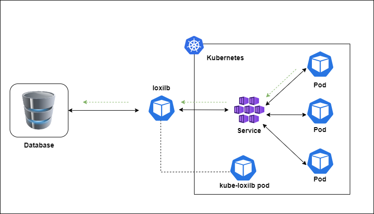

In Kubernetes, there are two key concepts - <b><i>Service and Endpoint</b></i>.

## What is Service?
A <b><i>"Service"</i></b> is a method that exposes an application running in one or more pods.

## What is an Endpoint?
An <b><i>"Endpoint"</b></i> defines a list of network endpoints(IP address and port), typically referenced by a Service to define which Pods the traffic can be sent to.

When we create a service in Kubernetes, usually we do not have to worry about the Endpoints' management as it is taken care by Kubernetes itself. But, sometimes not all the services run in a single cluster, some of them are hosted in other cluster(s) e.g. DB, storage, web services, trancoder etc. 

When endpoints are outside of the Kubernetes cluster, Endpoint objects can still be used to define and manage those external endpoints. This scenario is common when Kubernetes services need to interact with external systems, APIs, or services located outside of the cluster. Here's a practical example:

Suppose you have a Kubernetes cluster hosting a microservices-based application, and one of the services needs to communicate with an external database hosted outside of the cluster. In this case, you can use an Endpoint object to define the external database endpoint within Kubernetes.
In that case, your cloud-native apps needs to connect to the external services with external endpoints.


## Service with External Endpoint 
You can create an external service with loxilb as well. For this, You can simply create an Endpoint Object and then create a service using this endpoint object:



<b>endpoint.yml</b>
```
apiVersion: v1
kind: Endpoints
metadata:
  name: ext-tcp-lb
subsets:
  - addresses:
    - ip: 192.168.82.2
    ports:
    - port: 80
```

Create endpoint object:
```
$ kubectl apply -f endpoint.yml
```

View endpoints:
```
$ kubectl get ep
NAME         ENDPOINTS         AGE
kubernetes   10.0.2.15:6443    16m
ext-tcp-lb   192.168.82.2:80   16m
```

<b>service.yml</b>
```
apiVersion: v1
kind: Service
metadata:
  name: ext-tcp-lb
spec:
 loadBalancerClass: loxilb.io/loxilb
 type: LoadBalancer 
 ports:
    - protocol: TCP
      port: 8000
      targetPort: 80
```

Create Service:
```
$ kubectl apply -f service.yml
```

View Service:
```
NAME         TYPE           CLUSTER-IP      EXTERNAL-IP      PORT(S)           AGE
kubernetes   ClusterIP      10.43.0.1       <none>           443/TCP           16m
ext-tcp-lb   LoadBalancer   10.43.164.108   llb-20.20.20.1   8000:30355/TCP    15m
```
