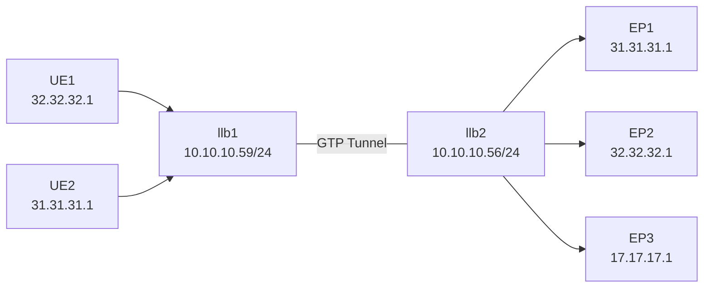

# Creating a simple test topology for loxilb

To test loxilb in a completely virtual environment, it is possible to quickly create a virtual test topology. We will explain the steps required to create a very simple topology (more complex topologies can be built using this example) :




Prerequisites :  

* The system should be x86 based (bare-metal or virtual)  
* Docker should be preinstalled  


```

Next step is to run the following script to create and configure the above topology. 

```
Please refer scenario3 in loxilb/cicd [script](https://github.com/loxilb-io/loxilb/blob/main/cicd/scenario3/config.sh)

Script will spawn dockers for UEs, loxilbs and endpoints. 

In the script, We are creating sessions and configuring load-balancer rule inside loxilb docker as follows :
```
dexec="docker exec -it "
##llb1 config
#ue1
$dexec llb1 loxicmd create session user1 88.88.88.88 --accessNetworkTunnel 1:10.10.10.56 --coreNetworkTunnel=1:10.10.10.59
 
$dexec llb1 loxicmd create sessionulcl user1 --ulclArgs=11:32.32.32.1
 
#ue2
$dexec llb1 loxicmd create session user2 88.88.88.88 --accessNetworkTunnel 2:10.10.10.56 --coreNetworkTunnel=2:10.10.10.59
 
$dexec llb1 loxicmd create sessionulcl user2 --ulclArgs=12:31.31.31.1

##llb2 config
#ue1
$dexec llb2 loxicmd create session user1 32.32.32.1 --accessNetworkTunnel 1:10.10.10.59 --coreNetworkTunnel=1:10.10.10.56
 

$dexec llb2 loxicmd create sessionulcl user1 --ulclArgs=11:88.88.88.88

#ue2
$dexec llb2 loxicmd create session user2 31.31.31.1 --accessNetworkTunnel 2:10.10.10.59 --coreNetworkTunnel=2:10.10.10.56
 
$dexec llb2 loxicmd create sessionulcl user2 --ulclArgs=12:88.88.88.88


##Create LB rule
$dexec llb2 loxicmd create lb 88.88.88.88 --tcp=2020:8080 --endpoints=25.25.25.1:1,26.26.26.1:1,27.27.27.1:1
```

So, we now have two instances loxilb running as a docker.
First instance of loxilb, llb1 is simulated as gNB as it is used to encap the incoming traffic from UE1 or UE2. Breakout, forward or loadbalancer rule can be configured on second instance llb2
We can run any workloads as we wish inside the host containers and start testing loxilb.

