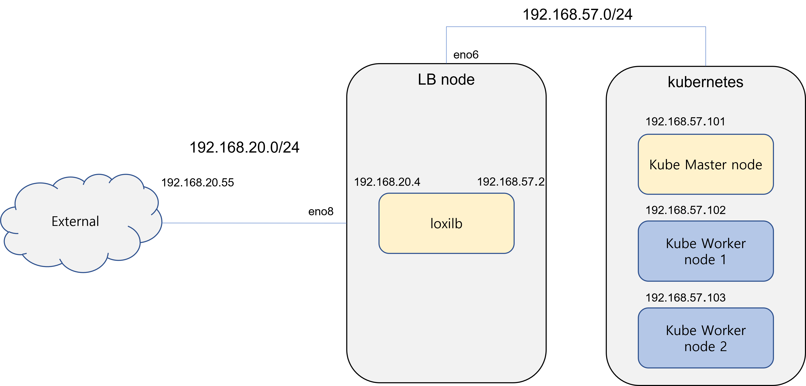

How to run loxilb with calico CNI in BGP mode
========
This article describes how to integrate loxilb using calico CNI in Kubernetes.

Setup
--------
For this example, kubernetes and loxilb are setup as follows:



Kubernetes uses a single master cluster for simplicity, all clusters use the same 192.168.57.0/24 subnet.
The load balancer node where the loxilb container is running is also connected to the same subnet as kubernetes. Externally, all kubernetes connections are configured to go through the "loxilb" load balancer node.

This example uses docker to run the loxilb container.
These examples assume that kubernetes & calico are already installed.

## 1. loxilb setup
### 1.1 docker network setup
In order to integrate loxilb and kubernetes, loxilb needs to be able to communicate with Kubernetes.
First, we create a docker network so that the loxilb container is also connected to the same network which is used by kubernetes nodes. Currently, the load balancer node is connected to kubernetes through the eno6 interface. Therefore, we will create a macvlan-type docker network that uses the eno6 interface as a parent and provide it to the loxilb docker.
Create a docker network with the following command:
```
sudo docker network create -d macvlan -o parent=eno6 \
  --subnet 192.168.57.0/24 \
  --gateway 192.168.57.1 \
  --aux-address 'cp1=192.168.57.101' \
  --aux-address 'cp2=192.168.57.102' \
  --aux-address 'cp3=192.168.57.103' k8snet
```
|Options|Description|
|----|----|
|-d macvlan|Specify network type as macvlan|
|-o parent=eno6|Create a macvlan type network using the eno6 interface as parent|
|--subnet 192.168.57.0/24|Specify network subnet|
|--gateway 192.168.57.1|Set gateway (optional)|
|--aux-address 'serverName=serverIP'|Option to register in advance so that IP addresses already in use on the network are not duplicated|
|k8snet|Name the network k8snet|

A docker network that can communicate with the outside is also created so that traffic accessing the kubernetes service from outside also goes through loxilb. The load balancer node is connected to the outside through eno8.
```
sudo docker network create -d macvlan -o parent=eno8 \
  --subnet 192.168.20.0/24 \
  --gateway 192.168.20.1 llbnet
```

We can check the network created with the docker network list command.

```
netlox@nd8:~$ sudo docker network list
NETWORK ID     NAME      DRIVER    SCOPE
5c97ae74fc32   bridge    bridge    local
6142f53e8be6   host      host      local
24ee7dbd7707   k8snet    macvlan   local
81c96ceda375   llbnet    macvlan   local
7bcd1738501b   none      null      local
```

### 1.2 loxilb docker setup
The loxilb container image is provided at [github][loxilbContainerImageUrl]. To download the docker image, use the following command.  

```
docker pull ghcr.io/loxilb-io/loxilb:latest
```

To run loxilb docker, we can use the following command.

```
sudo docker run -u root --cap-add SYS_ADMIN --restart unless-stopped \
  --privileged -dit -v /dev/log:/dev/log \
  --net=k8snet --ip=192.168.57.4 --name loxilb ghcr.io/loxilb-io/loxilb:latest \
  --host=0.0.0.0
```
The options that need to specified are:
|Options|Description|
|----|----|
|--net=k8snet|Network to connect to container|
|--ip=192.168.57.4|Specifies the IP address the container will use. If not specified, use any IP within the network subnet range|
|--name loxilb|Set container name|

We can check the docker created with the docker ps command.
```
netlox@nd8:~$ sudo docker ps
CONTAINER ID   IMAGE                  COMMAND                  CREATED       STATUS       PORTS       NAMES
eae349a283ae   loxilbio/loxilb:beta   "/root/loxilb-io/lox…"   11 days ago   Up 11 days               loxilb
```
Since we only connected the kubernetes network (k8snet) when running the docker above, we also need to connect to the docker network for external communication. Currently, docker only supports one network to be connected when running "docker run" command. But, its easy to connect other network to the docker with the following command:
```
sudo docker network connect llbnet loxilb
```

Once the connection is complete, we can see the docker container's interfaces as follows:

```
netlox@netlox:~$ sudo docker exec -ti loxilb ip route
default via 192.168.20.1 dev eth0
192.168.20.0/24 dev eth0 proto kernel scope link src 192.168.20.4
192.168.30.0/24 dev eth1 proto kernel scope link src 192.168.30.2
```

[loxilbContainerImageUrl]: https://github.com/loxilb-io/loxilb/pkgs/container/loxilb

## 2. loxi-ccm setup in kubernetes
loxi-ccm is a [ccm provider][k8sCcmDoc] to provide a loxilb load balancer to kubernetes, and it is essential for interworking with kubernetes and loxilb.
Refer to [the relevant document] [loxiCcmHowTo], change the apiServerURL of configMap to the IP address of loxilb created above and install it in kubernetes. If loxi-ccm is installed properly, the setup is complete.

[k8sCcmDoc]: https://kubernetes.io/ko/docs/concepts/architecture/cloud-controller/
[loxiCcmHowTo]: https://github.com/loxilb-io/loxilbdocs/blob/main/docs/ccm.md

## 3.Basic load-balancer test 

We can now give an External IP when you create a LoadBalancer type service in kubernetes. Create a test-nginx-svc.yaml file for testing as follows:

```
apiVersion: v1
kind: Pod
metadata:
  name: nginx
  labels:
    app.kubernetes.io/name: proxy
spec:
  containers:
  - name: nginx
    image: nginx:latest
    ports:
      - containerPort: 80
        name: http-web-svc
---
apiVersion: v1
kind: Service
metadata:
  name: nginx-service
spec:
  type: LoadBalancer
  selector:
    app.kubernetes.io/name: proxy
  ports:
  - name: name-of-service-port
    protocol: TCP
    port: 8888
    targetPort: http-web-svc
```

The above steps create the nginx pod and then associates a LoadBalancer service to it. The command to apply is as follows 

```
kubectl apply -f test-nginx-svc.yaml
```

We can verify that the service nginx-service has been created as a LoadBalancer type and has been assigned an External IP.
Now you can access the kubernetes service from outside using IP 123.123.123.15 and port 8888.

```
vagrant@node1:~$ sudo kubectl get svc
NAME            TYPE           CLUSTER-IP      EXTERNAL-IP      PORT(S)          AGE
kubernetes      ClusterIP      10.233.0.1      <none>           443/TCP          28d
nginx-service   LoadBalancer   10.233.21.235   123.123.123.15   8888:31655/TCP   3s
```

The LoadBalancer rule is also created in the loxilb container. We can check in the loxilb load-balancer node as follows   
  
```
netlox@nd8:~$ sudo docker exec -ti loxilb loxicmd get lb
|  EXTERNAL IP   | PORT | PROTOCOL | SELECT | # OF ENDPOINTS |
|----------------|------|----------|--------|----------------|
| 123.123.123.15 | 8888 | tcp      |      0 |              2 |
```

## 4. calico BGP & loxilb setup
If calico configures the network in BGP mode, loxilb must also operate in BGP mode. loxilb supports BGP functions based on goBGP. The following description assumes that calico is already set to use BGP mode.

### 4.1 loxilb BGP mode setup
If we create a loxilb container with the following command, it will run in BGP mode. The -b option at the end of the command is to enable BGP mode in loxilb.
  
```
sudo docker run -u root --cap-add SYS_ADMIN --restart unless-stopped \
  --privileged -dit -v /dev/log:/dev/log \
  --net=k8snet --ip=192.168.57.4 --name loxilb ghcr.io/loxilb-io/loxilb:latest \
  --host=0.0.0.0 -b
```

### 4.2 gobgp_loxilb.yaml file setup
Create a gobgp_loxilb.yaml file in the /etc/gobgp/ directory of the loxilb container.   

```
global:
    config:
        as: 65002
        router-id: 172.1.0.2
neighbors:
    - config:
        neighbor-address: 192.168.57.101
        peer-as: 64512
    - config:
        neighbor-address: 192.168.20.55
        peer-as: 64001
```

BGP information such as as-id and router-id of the loxilb container must be registered as global items.
The neighbors item need info about the IP address and as-id information of the BGP router peering with loxilb. In this example, calico's BGP information (192.168.57.101) and external BGP information (129.168.20.55) were registered.

### 4.3 Add router-id to the lo interface of the loxilb container
We need to add the IP registered as loxilb router-id in the gobgp_loxilb.yaml file to the lo interface of loxilb docker.   
```
sudo docker exec -ti loxilb ip addr add 172.1.0.2/32 dev lo
```

### 4.4 loxilb docker restart
Restart the loxilb docker for the settings in gobgp_loxilb.yaml to take effect.   
```
sudo docker stop loxilb
sudo docker start loxilb
```

### 4.5 Setup BGP Peer information in Calico
We also need to add loxilb's BGP peer information to calico. Create the calico-bgp-config.yaml file as follows:   
```
apiVersion: projectcalico.org/v3
kind: BGPPeer
metadata:
  name: my-global-peers2
spec:
  peerIP: 192.168.57.4
  asNumber: 65002
```

In peerIP, enter the IP address of loxilb. In asNumber, enter the as-ID of the loxilb BGP set above.
After creating the file, add BGP peer information to calico with the command below.
```
sudo calicoctl apply -f calico-bgp-config.yaml
```

### 4.6 Check BGP status
We now check the BGP connectivity in the loxilb docker like this:   
```
netlox@nd8:~$ sudo docker exec -ti loxilb3 gobgp neigh
Peer              AS  Up/Down State       |#Received  Accepted
192.168.57.101 64512 00:00:59 Establ      |        4         4
```

If the connection is successful, the State will  be shown as "Established".
We can check the route information of calico with the gobgp global rib command.
```
netlox@nd8:~$ sudo docker exec -ti loxilb3 gobgp global rib
   Network              Next Hop             AS_PATH              Age        Attrs
*> 10.233.71.0/26       192.168.57.101       64512                01:02:03   [{Origin: i}]
*> 10.233.74.64/26      192.168.57.101       64512                01:02:03   [{Origin: i}]
*> 10.233.75.0/26       192.168.57.101       64512                01:02:03   [{Origin: i}]
*> 10.233.102.128/26    192.168.57.101       64512                01:02:03   [{Origin: i}]
```
