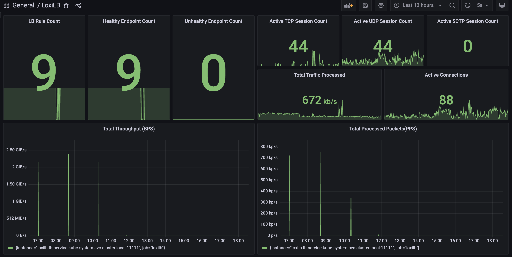
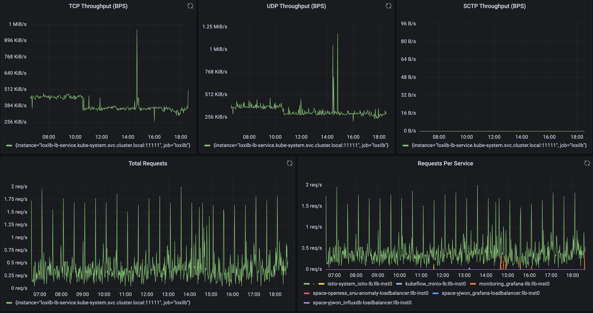
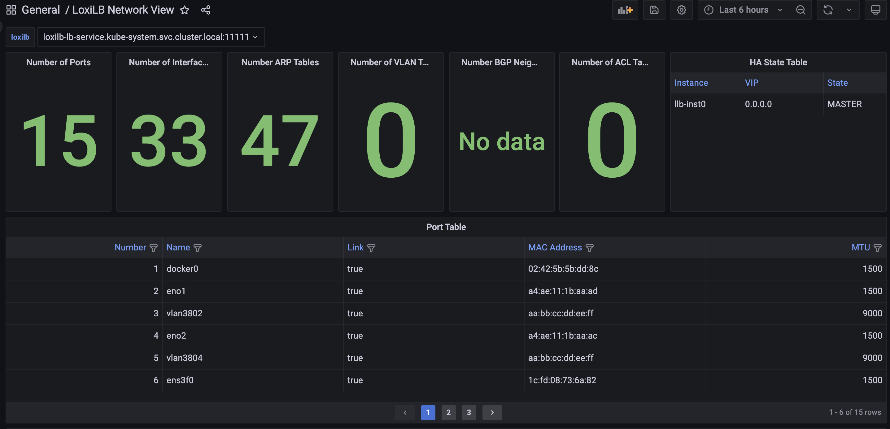
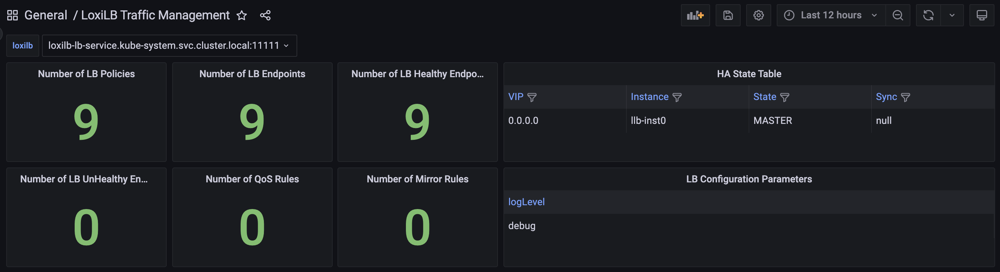

# LoxiLB Network Visibility Tool Documentation

## Table of Contents

- [Overview](#overview)
- [LoxiLB Collector](#loxilb-collector)
  - [Purpose](#purpose)
  - [Prometheus Metrics](#prometheus-metrics)
- [Architecture](#architecture)
- [Deployment Guide](#deployment-guide)
  - [Namespace Setup](#namespace-setup)
  - [LoxiLB Deployment](#loxilb-deployment)
  - [Kube-LoxiLB Deployment](#kube-loxilb-deployment)
  - [Prometheus and Loki Setup](#prometheus-and-loki-setup)
  - [Grafana Dashboard Setup](#grafana-dashboard-setup)
- [Configuration Details](#configuration-details)
  - [LoxiLB Configuration](#loxilb-configuration)
  - [Prometheus Configuration](#prometheus-configuration)
  - [Grafana Configuration](#grafana-configuration)
- [Grafana Dashboards](#grafana-dashboards)
  - [Home Dashboard](#home-dashboard)
  - [Network Dashboard](#network-dashboard)
  - [LoxiLB Traffic Management Dashboard](#loxilb-traffic-management-dashboard)
- [Troubleshooting](#troubleshooting)

## Overview

LoxiLB's Network Visibility Tool provides comprehensive observability for load balancing traffic using Prometheus for metrics collection and Grafana for visualization. This guide details the deployment and configuration steps to set up LoxiLB, Prometheus, Loki, and Grafana.

## LoxiLB Collector

### Purpose

LoxiLB supports exporting flow metrics with LoxiLB Kubernetes LoadBalancer service information and sending them to a LoxiLB Prometheus collector. This allows for in-depth monitoring and visibility into LoxiLB's performance and traffic handling.

### Prometheus Metrics

LoxiLB exposes various Prometheus metrics categorized as follows:

#### 1. Connection Metrics

| Metric Name              | Type  | Description |
|--------------------------|-------|-------------|
| `active_conntrack_count` | Gauge | The number of active established connections. |
| `active_flow_count_tcp`  | Gauge | The number of concurrent TCP flows. |
| `active_flow_count_udp`  | Gauge | The number of concurrent UDP flows. |
| `active_flow_count_sctp` | Gauge | The number of concurrent SCTP flows. |
| `inactive_flow_count`    | Gauge | The number of closed connections. |
| `new_flow_count`         | Gauge | The number of new connections. |

#### 2. Traffic Metrics

| Metric Name             | Type    | Description |
|-------------------------|---------|-------------|
| `processed_bytes`       | Counter | Total bytes processed. |
| `processed_tcp_bytes`   | Counter | Total TCP bytes processed. |
| `processed_udp_bytes`   | Counter | Total UDP bytes processed. |
| `processed_sctp_bytes`  | Counter | Total SCTP bytes processed. |
| `processed_packets`     | Counter | Total packets processed. |

#### 3. Request and Error Metrics

| Metric Name              | Type      | Description |
|--------------------------|-----------|-------------|
| `total_requests`         | Counter   | Total number of requests processed. |
| `total_errors`           | Counter   | Total number of errors encountered. |
| `total_requests_per_service` | CounterVec | Requests per service. |
| `total_errors_per_service`   | CounterVec | Errors per service. |

#### 4. Health Metrics

| Metric Name           | Type  | Description |
|-----------------------|-------|-------------|
| `healthy_host_count`  | Gauge | Number of healthy backend endpoints. |
| `unhealthy_host_count` | Gauge | Number of unhealthy backend endpoints. |

#### 5. Load Balancer Rule Metrics

| Metric Name        | Type  | Description |
|--------------------|-------|-------------|
| `lb_rule_count`    | Gauge | Total number of load balancing rules. |
| `consumed_lcus`    | Gauge | Number of Load Balancer Capacity Units (LCUs) used. |

#### 6. Firewall Metrics

| Metric Name             | Type    | Description |
|-------------------------|---------|-------------|
| `total_fw_drops`        | Gauge   | Number of packets dropped by the firewall. |
| `total_fw_drops_per_rule` | GaugeVec | Packets dropped per firewall rule. |

#### 7. Traffic Distribution Metrics

| Metric Name                     | Type      | Description |
|----------------------------------|-----------|-------------|
| `endpoint_load_dists_per_service` | GaugeVec  | Traffic distribution per service and endpoint. |
| `total_load_dists_per_service`    | GaugeVec  | Overall traffic distribution per service. |

## Architecture

### LoxiLB Visibility Tool Architecture

The LoxiLB Network Visibility tool integrates **Prometheus, Loki, and Grafana** to provide comprehensive monitoring and logging for load balancing operations. The key components of this architecture are:

#### LoxiLB:

- The core load balancer exporting metrics and logs.
- Exposes:
  - **Prometheus Export APIs** for real-time metric collection.
  - **Promtail** for forwarding logs to Loki.
  - **REST API** for additional visibility through Grafana’s **Infinity Plugin**.

#### Prometheus:

- Scrapes **LoxiLB Export APIs** to collect key metrics like connection status, traffic distribution, and error rates.
- Metrics are stored and made available for visualization in **Grafana** through the **Prometheus Plugin**.

#### Loki + Promtail:

- **Promtail** collects logs from LoxiLB and pushes them to **Loki**.
- **Loki** provides scalable log storage and indexing.
- Logs are visualized in **Grafana** through the **Loki Plugin**.

#### Grafana:

- The centralized visualization layer.
- Integrates three primary data sources:
  - **Prometheus Plugin** for metrics.
  - **Loki Plugin** for logs.
  - **Infinity Plugin** for REST API-based insights.

This architecture ensures real-time visibility into LoxiLB's performance, allowing operators to monitor network traffic, troubleshoot failures, and analyze logs efficiently.

## Deployment Guide

### Namespace Setup

Create the monitoring namespace:

```bash
kubectl apply -f - <<EOF
apiVersion: v1
kind: Namespace
metadata:
  name: monitoring
EOF
```

### LoxiLB Deployment

Deploy LoxiLB as a DaemonSet with Promtail for log forwarding:

```bash
kubectl apply -f https://raw.githubusercontent.com/NLX-SeokHwanKong/kube-loxilb/main/manifest/in-cluster-grafana/loxilb.yaml
```

### Kube-LoxiLB Deployment

Deploy Kube-LoxiLB with the following command:

```bash
kubectl apply -f https://raw.githubusercontent.com/NLX-SeokHwanKong/kube-loxilb/main/manifest/in-cluster-grafana/kube-loxilb.yaml
```

### Prometheus and Loki Setup

Deploy Prometheus and Loki:

```bash
kubectl apply -f loxilb-collector.yaml
```

### Grafana Dashboard Setup

Deploy Grafana and configure it to use Prometheus and Loki as data sources:

```bash
kubectl apply -f loxilb-grafana.yaml
```

Run the following command to check if ClickHouse and Grafana are deployed properly:
```bash
kubectl get all -n monitoring
```

The expected results will be like:

```bash
NAME                               READY   STATUS    RESTARTS   AGE
pod/grafana-llb-674d977bcd-tg48p   1/1     Running   0          53m
pod/loki-84889c745c-bmppk          1/1     Running   0          8d
pod/prometheus-54958dc4c8-l72t7    1/1     Running   0          8d

NAME                     TYPE           CLUSTER-IP      EXTERNAL-IP         PORT(S)           AGE
service/grafana-llb      LoadBalancer   10.233.39.107   llb-192.168.0.251   59301:30115/TCP   53m
service/grafana-svc      ClusterIP      10.233.39.130   <none>              3000/TCP          53m
service/loki             ClusterIP      10.233.51.93    <none>              3100/TCP          8d
service/loki-llb         LoadBalancer   10.233.20.171   llb-192.168.0.251   59302:32475/TCP   8d
service/prometheus       ClusterIP      10.233.10.55    <none>              9090/TCP          8d
service/prometheus-llb   LoadBalancer   10.233.2.91     llb-192.168.0.251   59303:30893/TCP   8d

NAME                          READY   UP-TO-DATE   AVAILABLE   AGE
deployment.apps/grafana-llb   1/1     1            1           53m
deployment.apps/loki          1/1     1            1           8d
deployment.apps/prometheus    1/1     1            1           8d

NAME                                     DESIRED   CURRENT   READY   AGE
replicaset.apps/grafana-llb-674d977bcd   1         1         1       53m
replicaset.apps/loki-84889c745c          1         1         1       8d
replicaset.apps/prometheus-54958dc4c8    1         1         1       8d

```

Run the following commands to print the IP of the workder Node and the Port
that Grafana is listening on:

```bash
GRAFANA_LB_IP=$(kubectl get svc grafana-llb -n monitoring -o jsonpath='{.status.loadBalancer.ingress[0].hostname}')
if [ -z "$GRAFANA_LB_IP" ]; then
    GRAFANA_LB_IP=$(kubectl get svc grafana-llb -n monitoring -o jsonpath='{.status.loadBalancer.ingress[0].ip}')
fi

# Get the LoadBalancer service port
GRAFANA_PORT=$(kubectl get svc grafana-llb -n monitoring -o jsonpath='{.spec.ports[0].port}')

# Check if GRAFANA_LB_IP is empty, fallback to NodePort access
if [ -z "$GRAFANA_LB_IP" ]; then
    echo "No external LoadBalancer IP found! Falling back to NodePort access."

    # Get the node where Grafana is running
    NODE_NAME=$(kubectl get pod -l app=grafana -n monitoring -o jsonpath='{.items[0].spec.nodeName}')
    NODE_IP=$(kubectl get nodes ${NODE_NAME} -o jsonpath='{.status.addresses[0].address}')

    # Get the NodePort assigned to Grafana
    GRAFANA_NODEPORT=$(kubectl get svc grafana-llb -n monitoring -o jsonpath='{.spec.ports[*].nodePort}')

    echo "=== Grafana Service is accessible via NodePort at http://${NODE_IP}:${GRAFANA_NODEPORT} ==="
    echo "You can now open the Grafana dashboard in the browser using:"
    echo "  http://${NODE_IP}:${GRAFANA_NODEPORT}"
else
    echo "=== Grafana Service is accessible at http://${GRAFANA_LB_IP}:${GRAFANA_PORT} ==="
    echo "You can now open the Grafana dashboard in the browser using:"
    echo "  http://${GRAFANA_LB_IP}:${GRAFANA_PORT}"
fi

echo "You should be able to see the Grafana login page."
echo "Default login credentials:"
echo "  Username: admin"
echo "  Password: password"
```

You can now open the Grafana dashboard in the browser using `http://[NodeIP]:[GRAFANA_PORT]`.
You should be able to see a Grafana login page. Login credentials:

- username: admin
- password: password

## Configuration Details

### LoxiLB Configuration

LoxiLB is configured to export metrics via Prometheus and logs via Loki. The configuration includes:
- **Prometheus Exporter**: Exposes metrics on `/netlox/v1/metrics`.
- **Promtail Logging Integration**: Forwards logs to Loki.
- **Annotations for LoadBalancer Services**: Enables integration with monitoring tools.

### Prometheus Configuration

Prometheus is configured to scrape metrics from LoxiLB using the following configuration:

```yaml
scrape_configs:
  - job_name: 'loxilb'
    metrics_path: /netlox/v1/metrics
    static_configs:
      - targets:
        - 'loxilb-lb-service.kube-system.svc.cluster.local:11111'
```

### Grafana Configuration

Grafana is configured with Prometheus and Loki as data sources. The configuration includes:

```yaml
apiVersion: 1
datasources:
  - name: Prometheus
    type: prometheus
    access: proxy
    url: http://prometheus:9090
  - name: Loki
    type: loki
    access: proxy
    url: http://loki:3100
```

### Grafana Credentials Configuration

Grafana credentials are specified in `loxilb-grafana.yml` as a Secret
named `grafana-admin-secret` as shown below. Please also make the corresponding
changes.

```yaml
apiVersion: v1
kind: Secret
metadata:
  name: grafana-admin-secret
  namespace: monitoring
type: Opaque
data:
  admin-password: cGFzc3dvcmQ=  # Base64-encoded password (e.g., 'password')
```

## Grafana Dashboards

### Home Dashboard

Home dashboard is the LoxiLB dashboard in the general folder. You will see it after logging into Grafana. It provides an overview of the monitored LoxiLB cluster.

#### Traffic Throughput & Requests Metrics


This section displays the total traffic processed by LoxiLB across different protocols, along with request rate statistics.

##### Panels:
- **TCP Throughput (BPS)**: Tracks TCP traffic processed by LoxiLB in bytes per second.
- **UDP Throughput (BPS)**: Tracks UDP traffic processed by LoxiLB.
- **SCTP Throughput (BPS)**: Displays SCTP traffic throughput, useful in telecom and specialized workloads.
- **Total Requests**: Shows the request rate over time.
- **Requests Per Service**: Breaks down request volume per service, identifying load distribution across multiple services.

#### Connection & Flow Metrics

This section provides insights into active and new connections.


##### Panels:
- **New Flow Count**: Displays the rate of new connections initiated.
- **Active Flow Count (TCP, UDP, SCTP)**: Monitors the number of ongoing TCP, UDP, and SCTP flows.
- **Firewall Drops (Top 5 Rules)**: Shows the top firewall rules that resulted in dropped packets.
- **Total Firewall Drops**: Summarizes all packet drops due to firewall rules.

#### Traffic Distribution by Endpoints & Services

These panels analyze traffic distribution across services and endpoints.


##### Panels:
- **Top 5 Endpoints by Traffic**: Displays the five backend endpoints handling the most traffic.
- **Top 5 Endpoint Distribution (Pie Chart)**: Graphical representation of traffic distribution among the top endpoints.
- **Top 5 Services by Traffic**: Shows which services are consuming the most bandwidth.
- **Traffic Distribution by Service (Pie Chart)**: Breaks down service-level traffic in a pie chart.

#### Load Balancer Health & Session Metrics

This section tracks the health of load balancer rules and active session counts.



##### Panels:
- **LB Rule Count**: Shows the number of active load balancing rules.
- **Healthy Endpoint Count**: Displays the number of healthy backend services.
- **Unhealthy Endpoint Count**: Alerts when backend services become unhealthy.
- **Active TCP, UDP, SCTP Session Count**: Monitors active sessions for each protocol.
- **Total Processed Traffic (BPS)**: Measures the aggregate traffic handled by LoxiLB.
- **Total Processed Packets (PPS)**: Displays total packet processing rate.

### Network Dashboard

The Network Dashboard provides a real-time overview of LoxiLB's network state, including interface statistics, ARP tables, routing information, and high availability (HA) status.




#### Network Table information

##### Panels:
- **Number of Ports**: Displays the total number of network ports managed by LoxiLB.
- **Number of Interfaces**: Shows the total network interfaces available.
- **Number of ARP Tables**: Indicates the count of ARP (Address Resolution Protocol) entries being tracked.
- **Number of VLAN Tables**: Displays the number of VLAN configurations present in the system.
- **Number of BGP Neighbors**: Shows the total count of configured BGP neighbors.
- **Number of ACL Tables**: Displays the total ACL (Access Control List) rules applied.

##### Additional Tables:
- **ARP Table**: Displays the real-time ARP cache, mapping IP addresses to MAC addresses.
- **Route Table**: Lists active routes, including destination addresses, route flags, and packet/byte counters.
- **Port Table**: Provides details on network interfaces, including MAC addresses, MTU settings, and port activity.
- **HA State Table**: Displays high availability status, indicating whether the LoxiLB instance is operating in MASTER or BACKUP mode.

This dashboard is essential for network administrators to monitor LoxiLB’s network configuration and troubleshoot connectivity issues efficiently.

### LoxiLB Traffic Management Dashboard

The LoxiLB Traffic Management Dashboard focuses on policies, load balancing rules, and endpoint monitoring. It provides insights into active LB policies, endpoint states, and high-availability configurations.

#### LoxiLB Configuration & Monitoring information

##### Panels:

- **Number of LB Policies**: Displays the count of active load balancer policies.
- **Number of LB Endpoints**: Shows the total number of backend endpoints.
- **Number of Healthy Endpoints**: Displays the count of healthy endpoints.
- **Number of Unhealthy Endpoints**: Indicates any failed or unhealthy endpoints.
- **Number of QoS Rules**: Displays the number of QoS policies applied.
- **Number of Mirror Rules**: Shows the active mirroring policies.


- **HA State Table**: Displays the High Availability (HA) status of LoxiLB instances.
- **LB Configuration Parameters**: Displays key configuration settings for LoxiLB.
- **Traffic Pair Analysis**: Shows the top traffic pairs between source and destination.
- **Service Graph**: A network graph representation of LoxiLB traffic distribution.


## Troubleshooting

- Ensure all pods in the `monitoring` namespace are running:

```bash
kubectl get pods -n monitoring
```

- Check logs for Prometheus, Loki, and Grafana:

```bash
kubectl logs -n monitoring -l app=prometheus
kubectl logs -n monitoring -l app=loki
kubectl logs -n monitoring -l app=grafana
```

- Validate service endpoints:

```bash
kubectl get svc -n monitoring
```

- If Prometheus is not scraping metrics correctly, ensure that the target LoxiLB metrics endpoint is reachable:

Run the following commands to print the IP of the workder Node and the Port
that Prometheus is listening on:

```bash
PROMETHEUS_LB_IP=$(kubectl get svc prometheus-llb -n monitoring -o jsonpath='{.status.loadBalancer.ingress[0].hostname}')
if [ -z "$PROMETHEUS_LB_IP" ]; then
    PROMETHEUS_LB_IP=$(kubectl get svc prometheus-llb -n monitoring -o jsonpath='{.status.loadBalancer.ingress[0].ip}')
fi

# Get the LoadBalancer service port
PROMETHEUS_PORT=$(kubectl get svc prometheus-llb -n monitoring -o jsonpath='{.spec.ports[0].port}')

# Check if PROMETHEUS_LB_IP is empty, fallback to NodePort access
if [ -z "$PROMETHEUS_LB_IP" ]; then
    echo "No external LoadBalancer IP found! Falling back to NodePort access."

    # Get the node where Grafana is running
    NODE_NAME=$(kubectl get pod -l app=grafana -n monitoring -o jsonpath='{.items[0].spec.nodeName}')
    NODE_IP=$(kubectl get nodes ${NODE_NAME} -o jsonpath='{.status.addresses[0].address}')

    # Get the NodePort assigned to Grafana
    PROMETHEUS_NODEPORT=$(kubectl get svc prometheus-llb -n monitoring -o jsonpath='{.spec.ports[*].nodePort}')

    echo "=== Grafana Service is accessible via NodePort at http://${NODE_IP}:${PROMETHEUS_NODEPORT} ==="
    echo "You can now open the Grafana dashboard in the browser using:"
    echo "  http://${NODE_IP}:${PROMETHEUS_NODEPORT}"
else
    echo "=== Grafana Service is accessible at http://${PROMETHEUS_LB_IP}:${PROMETHEUS_PORT} ==="
    echo "You can now open the Grafana dashboard in the browser using:"
    echo "  http://${PROMETHEUS_LB_IP}:${PROMETHEUS_PORT}"
fi
```

You can now open the Prometheus dashboard in the browser using `http://[NodeIP]:[PROMETHEUS_PORT]`.

Then, visit `http://[NodeIP]:[PROMETHEUS_PORT]/targets` and verify that the LoxiLB metrics endpoint is listed and marked as `UP`.

- If Loki logs are missing in Grafana, check the log pipeline configuration and Promtail logs:

```bash
kubectl logs -n monitoring -l app=promtail
```

This document provides a comprehensive overview of the metrics exposed by LoxiLB. Use these metrics to monitor performance, identify issues, and optimize your load balancer configuration. For further assistance, consult the LoxiLB documentation or contact the NetLOX support team.


