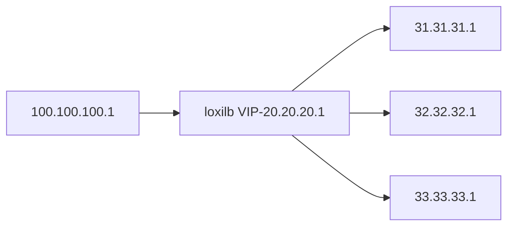
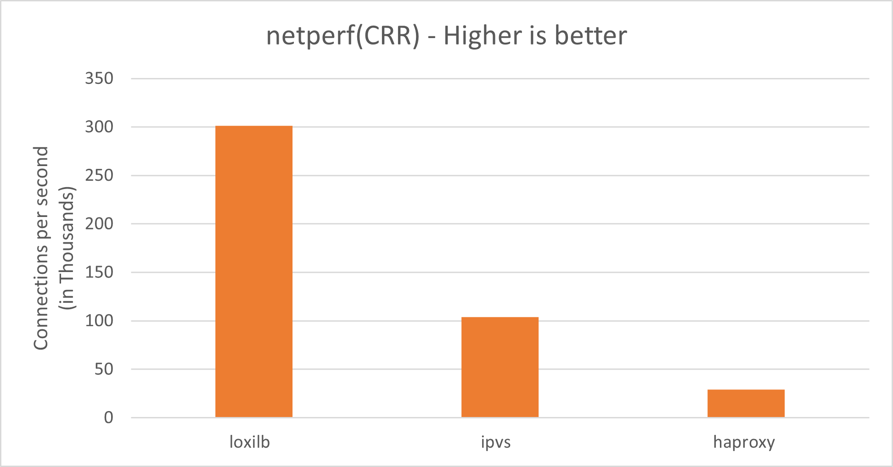

## Bare-Metal Performance

The topology for this test is as follows :



 In this test, all the hosts, end-points and load-balancer run in separate dedicated servers. Server specs used - 
*Intel(R) Xeon(R) Silver 4210R CPU @ 2.40GHz - 40 core RAM 125GB, Kernel 5.15.0-52-generic*. The following command can be used to configure loxilb for the given topology:

```
# loxicmd create lb 20.20.20.1 --tcp=2020:5001 --endpoints=31.31.31.1:1,32.32.32.1:1,33.33.33.1:1
```

The default mode of LoxiLB is RR(round-robin) and the traffic distribution will be as follows:


We run popular tool **[netperf](https://github.com/HewlettPackard/netperf)** for the above topology. A quick explanation of terminologies used :

**RPS** - requests per seconds. Given a fixed number of connections, this denotes how many requests/message per second can be supported    
**CPS** - connections per second. This denotes how many new TCP connection setup/teardowns can be supported per second and hence one of the most important indicators of load-balancer performance     
**CRR** - connect/request/response. This is same as CPS but netperf tool uses this term to refer to CPS as part of its test scenario       
**RR** - request/response. This is another netperf test option. We used it to measure min and avg latency   

We are comparing **loxilb** with **ipvs** and **haproxy**. 

The results are as follows :

### Connections per second (TCP_CRR)


### Requests per second (TCP_RR)


### Minimum Latency


### Average Latency


#### Conclusion/Notes -   

* loxilb provides enhanced performance across the spectrum of tests.  There is a noticeable gain in CPS.
* loxilb's CPS scales linearly with number of cores
* haproxy version used - 2.0.29
* netperf test scripts can be found [here](https://github.com/loxilb-io/loxilb/tree/main/cicd/tcplbcps)
