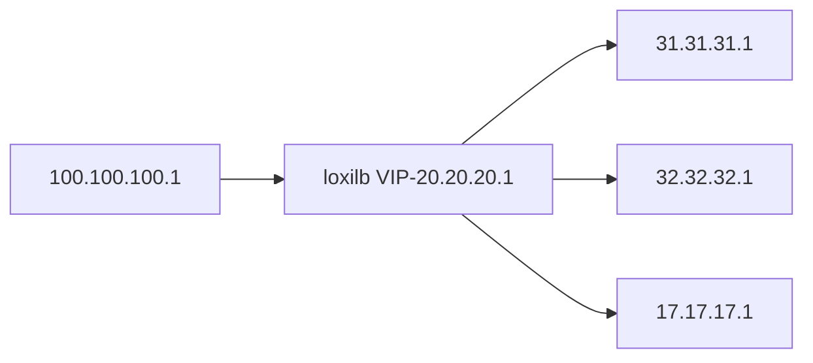
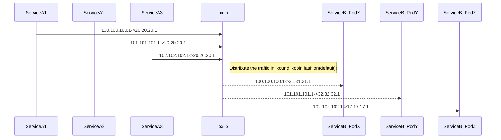

## Bare-Metal Performance

The topology for this test is as follows :



 All the services (hosts and end-points) run in one server and loxilb runs in a separate dedicated server. loxilb server specs used - 
*Intel(R) Xeon(R) Silver 4210R CPU @ 2.40GHz - 40 core RAM 125GB*. The description of test-tools and usage can be found [here](docs/perf-single.md). The following command can be used to configure lb for the given topology:

```
# loxicmd create lb 20.20.20.1 --tcp=2020:5001 --endpoints=31.31.31.1:1,32.32.32.1:1,17.17.17.1:1
```

In default RR mode of LoxiLB, the traffic distribution will be as follows:



We use wrk HTTP benchmarking tool for this test as well. This is run inside the client "100.100.100.1" host.
```
root@loxilb:/home/loxilb # wrk -t8 -c400 -d30s http://20.20.20.1:2020/
Running 30s test @ http://20.20.20.1:2020/
  8 threads and 400 connections
  Thread Stats   Avg      Stdev     Max   +/- Stdev
    Latency     2.44ms   10.58ms 222.86ms   99.14%
    Req/Sec    39.06k     4.90k   57.34k    64.62%
  9331956 requests in 30.07s, 667.47MB read
Requests/sec: 310364.26
Transfer/sec:     22.20MB
```

## Comparision with [LVS](https://en.wikipedia.org/wiki/Linux_Virtual_Server)

LVS is based on linux kernel networking and is a popular open-source load-balancer. Comparision with LVS will show us how eBPF can improve on linux kernel networking

ipvsadm configuration(Check [here](https://dev.to/douglasmakey/how-to-setup-simple-load-balancing-with-ipvs-demo-with-docker-4j1d) for more details)
```
root@1167483bd551:/# ip addr add 20.20.20.1/32 dev lo
root@1167483bd551:/# ipvsadm -A -t 20.20.20.1:2020 -s rr
root@1167483bd551:/# ipvsadm -a -t 20.20.20.1:2020 -r 17.17.17.1:5001 -m
root@1167483bd551:/# ipvsadm -a -t 20.20.20.1:2020 -r 31.31.31.1:5001 -m
root@1167483bd551:/# ipvsadm -a -t 20.20.20.1:2020 -r 32.32.32.1:5001 -m
```

We use wrk HTTP benchmarking tool for this test as well. This is run inside the client "100.100.100.1" host.
```
root@loxilb:/home/loxilb # wrk -t8 -c400 -d30s http://20.20.20.1:2020/
Running 30s test @ http://20.20.20.1:2020/
  8 threads and 400 connections
  Thread Stats   Avg      Stdev     Max   +/- Stdev
    Latency     3.81ms   17.66ms 222.32ms   98.02%
    Req/Sec    37.35k     3.72k  115.09k    72.18%
  8925647 requests in 30.10s, 638.41MB read
Requests/sec: 296537.63
Transfer/sec:     21.21MB
```

ipvsadm statistics
```
root@1167483bd551:/# ipvsadm -l --stats
IP Virtual Server version 1.2.1 (size=4096)
Prot LocalAddress:Port               Conns   InPkts  OutPkts  InBytes OutBytes
  -> RemoteAddress:Port
TCP  20.20.20.1:2020                   401  8939187  8953980  830843K    1135M
  -> 17.17.17.1:5001                   134  3026088  3031335  281255K  384268K
  -> 1.31.31.31.dyn.idknet.com:50      133  2959491  2964454  275069K  375809K
  -> 32.32.32.1:5001                   134  2953608  2958191  274518K  375034K
```

## Conclusion
loxilb's latency is 2.44 ms which is much less as compared to 3.81 ms in case of LVS. Number of Requests handled per second is 39.06K with loxilb, better than 37.35K with LVS.
