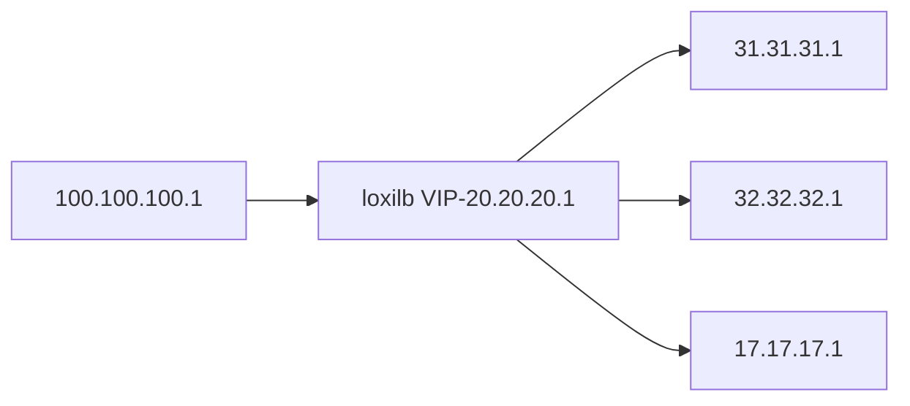

## Single-node (all-in-one cnf) performance 

All hosts/loxiLB/end-point nodes are simulated with docker pods inside a single node. The topology is as follows :



The following command can be used to configure lb for the given topology:

```
# loxicmd create lb 20.20.20.1 --tcp=2020:5001 --endpoints=31.31.31.1:1,32.32.32.1:1,17.17.17.1:1
```

To create the above topology for testing loxilb, users can follow this [guide](simple_topo.md). A go webserver with an empty response is used for benchmark purposes. The code is as following :

```
package main

import (
        "log"
        "net/http"
)

func main() {
        http.HandleFunc("/", func(w http.ResponseWriter, r *http.Request) {

        })
        if err := http.ListenAndServe(":5001", nil); err != nil {
                log.Fatal("ListenAndServe: ", err)
        }
}
```
The above code runs in each of the load-balancer end-points as following :

```
go run ./webserver.go
```

We use [wrk](https://github.com/wg/wrk) HTTP benchmarking tool for this test. This tool is run with the following parameters:

```
root@loxilb:/home/loxilb # wrk -t8 -c400 -d30s http://20.20.20.1:2020/
```
- where t: No. of threads, c: No. of connections. d: Duration of test

We also run other popular tools like iperf, qperf along with wrk for the above topology. The results are as follows :

1. System Configuration - Intel(R) Core(TM) i7-4770HQ CPU @ 2.20GHz , 3-Core,  6GB RAM

| Tool  |loopback   |loxilb   |ipvs   |
|---|---|---|---|
|wrk(RPS) |38040| 44833  | 40012  |
|wrk(CPS)| n/a  | 7020  |  6048 |
|qperf(LAT)|12.31 us  |15.9us   |  24.75us  |
|iperf   | 43.5Gbps  |41.2Gbps   | 34.4Gbps  |

2. System Configuration - Intel(R) Xeon(R) Silver 4210R CPU @ 2.40GHz, 40-core, 124GB RAM

| Tool  |loopback   |loxilb   |ipvs   |haproxy   |
|---|---|---|---|---|
|wrk(RPS) |406953| 421746  | 388021  |217004  |
|wrk(CPS)| n/a  | 45064  |  24400 |22000 |
|iperf   | 456Gbps  |402Gbps   | 374Gbps  |91Gbps  |

* loxilb provides ~10% increase in most of the performance parameters while there is a big gain in CPS
* loxilb's CPS is limited only by the fact that this is a single node scenario with shared resources
* "loopback" here refers to client and server running in the same docker/container. This is supposed to be the best case scenario but there is only a single end-point, so the RPS measurements are lower.
* Please refer to this [article](https://community.f5.com/t5/technical-articles/understanding-performance-metrics-and-network-traffic/ta-p/286109) for a good explanation of performance metrics
* iperf is run with 100 threads
