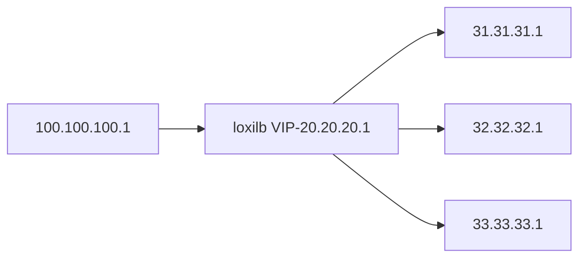

## Single-node performance 

The hosts/LB/end-points are run in docker pods inside a single node. The topology is as follows :



The testing is done with full stateful connection tracking enabled (non dsr mode). The following command can be used to configure lb for the given topology:

```
# loxicmd create lb 20.20.20.1 --tcp=2020:5001 --endpoints=31.31.31.1:1,32.32.32.1:1,33.33.33.1:1
```

To create the above topology for testing loxilb, users can follow this [guide](simple_topo.md). A go webserver with an empty response is used for benchmark purposes. The code is as following :

```
package main

import (
        "log"
        "net/http"
)

func main() {
        http.HandleFunc("/", func(w http.ResponseWriter, r *http.Request) {

        })
        if err := http.ListenAndServe(":5001", nil); err != nil {
                log.Fatal("ListenAndServe: ", err)
        }
}
```
The above code runs in each of the load-balancer end-points as following :

```
go run ./webserver.go
```

[wrk](https://github.com/wg/wrk) based HTTP benchmarking is one of the tools used in this test. This tool is run with the following parameters:

```
root@loxilb:/home/loxilb # wrk -t8 -c400 -d30s http://20.20.20.1:2020/
```
- where t: No. of threads, c: No. of connections. d: Duration of test

We also run other popular performance testing tools like [netperf](https://github.com/HewlettPackard/netperf), [iperf](https://iperf.fr/) along with wrk for the above topology. A quick explanation of terminologies used :

**RPS** - requests per seconds. Given a fixed number of connections, this denotes how many requests/message per second can be supported    
**CPS** - connections per second. This denotes how many new TCP connection setup/teardowns can be supported per second and hence one of the most important indicators of load-balancer performance     
**CRR** - connect/request/response. This is same as CPS but netperf tool uses this term to refer to CPS as part of its test scenario       
**RR** - request/response. This is another netperf test option. We used it to measure min and avg latency   

The results are as follows :

#### Case 1. System Configuration - Intel(R) Core(TM) i7-4770HQ CPU @ 2.20GHz , 3-Core,  6GB RAM, Kernel 5.15.0-52-generic

| Tool  |loopback   |loxilb   |ipvs   |
|---|---|---|---|
|wrk(RPS) |38040| 44833  | 40012  |
|wrk(CPS)| n/a  | 7020  |  6048 |
|netperf(CRR)| n/a| 11674 | 9901|
|netperf(RR min)|12.31 us  |15.2us   |  19.75us  |
|netperf(RR avg)|61.27 us  |78.1us   |  131us  |
|iperf   | 43.5Gbps  |41.2Gbps   | 34.4Gbps  |

#### Case 2. System Configuration - Intel(R) Xeon(R) Silver 4210R CPU @ 2.40GHz, 40-core, 124GB RAM, Kernel 5.15.0-52-generic

| Tool  |loopback   |loxilb   |ipvs   |haproxy   |
|---|---|---|---|---|
|wrk(RPS) |406953| 421746  | 388021  |217004  |
|wrk(CPS)| n/a  | 45064  |  24400 |22000 |
|netperf(CRR)| n/a| 375k | 174k| 21k|
|netperf(RR min)| n/a | 12 us  |15us   |  27us  |
|netperf(RR avg)| n/a | 15.78 us  |18.25us   |  35.76us  |
|iperf   | 456Gbps  |402Gbps   | 374Gbps  |91Gbps  |

#### Conclusion/Notes -   

* loxilb provides enhanced performance across the spectrum of tests.  There is a noticeable gain in CPS
* loxilb's CPS is limited only by the fact that this is a single node scenario with shared resources
* "loopback" here refers to client and server running in the same host/pod. This is supposed to be the best case scenario but since there is only a single end-point for lo compared to 3 for LB testing , hence the RPS measurements are on the lower side.
* iperf is run with 100 threads ( iperf X.X.X.X -P 100 )
* haproxy version used - 2.0.29
* netperf test scripts can be found [here](https://github.com/loxilb-io/loxilb/tree/main/cicd/tcplbcps)

### Watch the video

[](https://www.youtube.com/watch?v=MJXcM0x6IeQ)

