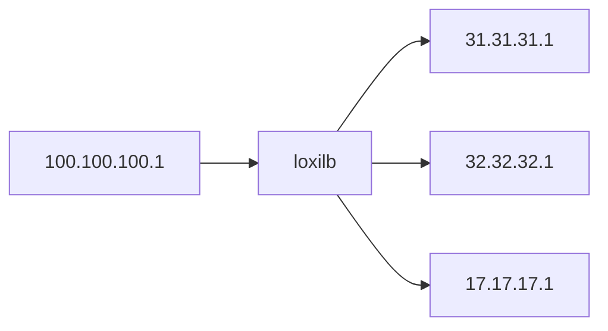

# loxilb Performance

## Single node performance (simple)

loxilb is run as a docker inside a VM. The VM is assigned the following resources :  

*Intel(R) Core(TM) i7-4770HQ CPU @ 2.20GHz - 2 core RAM 4GB*

All the other hosts are simulated with docker pods inside the same VM. The following command can be used to configure lb for the given topology:

```
# loxicmd create lb 20.20.20.1 --tcp=2020:5001 --endpoints=31.31.31.1:1,32.32.32.1:1,17.17.17.1:1
```



A go webserver with an empty response is used for benchmark purposes. The code is as following :

```
package main

import (
        "log"
        "net/http"
)

func main() {
        http.HandleFunc("/", func(w http.ResponseWriter, r *http.Request) {

        })
        if err := http.ListenAndServe(":5001", nil); err != nil {
                log.Fatal("ListenAndServe: ", err)
        }
}
```
The above code is run in each of the load-balancer end-points.

We use [wrk](https://github.com/wg/wrk) HTTP benchmarking tool for this test. This is run inside the client "100.100.100.1" host. 

```
root@loxilb:/home/loxilb # wrk -t8 -c400 -d30s http://20.20.20.1:2020/
Running 30s test @ http://20.20.20.1:2020/
  8 threads and 400 connections
  Thread Stats   Avg      Stdev     Max   +/- Stdev
    Latency    11.93ms   13.66ms 164.26ms   86.43%
    Req/Sec     5.82k     0.99k   14.19k    70.55%
  1391123 requests in 30.09s, 99.50MB read
Requests/sec:  46232.45
Transfer/sec:  3.31MB
```

As a baseline, we compare the numbers with loopback test i.e running *wrk* in the same host as the webserver
```
root@loxilb:/home/loxilb # wrk -t8 -c400 -d30s http://127.0.0.1:5001/
Running 30s test @ http://127.0.0.1:5001/
  8 threads and 400 connections
  Thread Stats   Avg      Stdev     Max   +/- Stdev
    Latency    15.20ms   19.81ms 240.03ms   86.30%
    Req/Sec     5.90k     3.74k   24.39k    74.35%
  1410741 requests in 30.08s, 100.90MB read
Requests/sec:  46894.07
Transfer/sec:  3.35MB
```

Based on the above tests, loxilb performs at 98% of the baseline numbers in requests/sec and latency actually improves by 20% with loxilb.

## Multi node performance (real topology)

The topology for this test is similar to the above case. However, all the hosts (client and load-balancer end-points) as well as loxilb run in separate dedicated systems. All other configurations remain the same

*Perf numbers to be updated*

## Comparision with [LVS](https://en.wikipedia.org/wiki/Linux_Virtual_Server)

LVS is based on linux kernel networking and is a popular open-source load-balancer. Comparision with LVS will show us how eBPF can improve on linux kernel networking

*To be done and updated*


