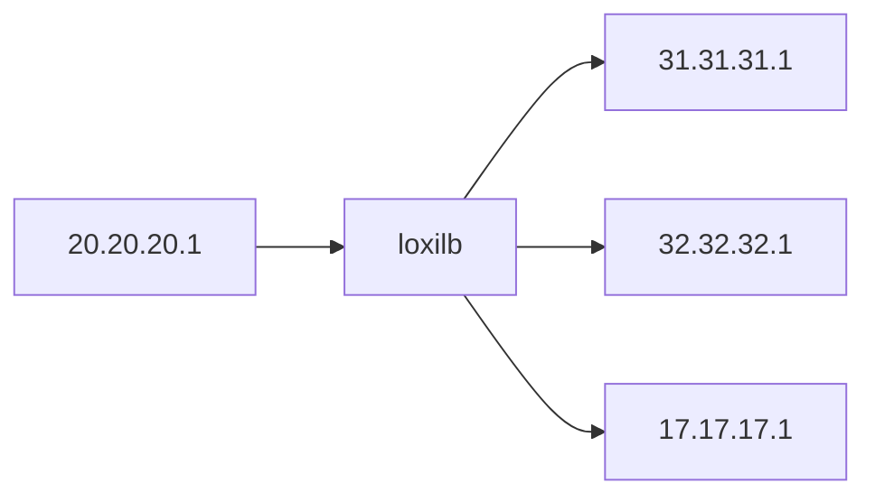
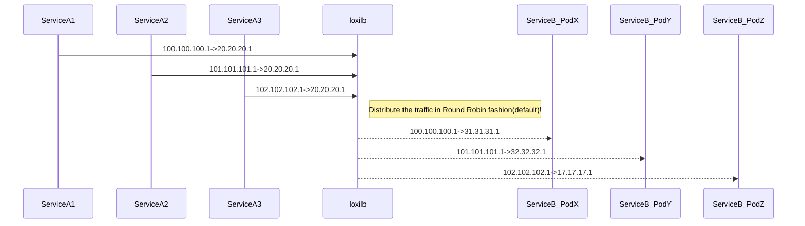

# loxilb Performance

## Single node performance

All hosts/loxiLB/end-point nodes are simulated with docker pods inside a single node. The topology is as follows :



The following command can be used to configure lb for the given topology:

```
# loxicmd create lb 20.20.20.1 --tcp=2020:5001 --endpoints=31.31.31.1:1,32.32.32.1:1,17.17.17.1:1
```

To create the above topology for testing loxilb, users can follow this [guide](simple_topo.md). A go webserver with an empty response is used for benchmark purposes. The code is as following :

```
package main

import (
        "log"
        "net/http"
)

func main() {
        http.HandleFunc("/", func(w http.ResponseWriter, r *http.Request) {

        })
        if err := http.ListenAndServe(":5001", nil); err != nil {
                log.Fatal("ListenAndServe: ", err)
        }
}
```
The above code runs in each of the load-balancer end-points as following :

```
go run ./webserver.go
```

We use [wrk](https://github.com/wg/wrk) HTTP benchmarking tool for this test. This tool is run with the following parameters:

```
root@loxilb:/home/loxilb # wrk -t8 -c400 -d30s http://20.20.20.1:2020/
```
- where t: No. of threads, c: No. of connections. d: Duration of test

We also run other popular tools like iperf, qperf along with wrk for the above topology. The results are as follows :

1. System Configuration - Intel(R) Core(TM) i7-4770HQ CPU @ 2.20GHz , 3-Core,  6GB RAM

| Tool  |loopback   |loxilb   |ipvs   |
|---|---|---|---|
|wrk(RPS) |38040| 44833  | 40012  |
|wrk(CPS)| n/a  | 7020  |  6048 |
|iperf   | 21Gbps  |19.5Gbps   | 16Gbps  |
|qperf(LAT)|12.31 us  |15.9us   |  24.75us  |

2. System Configuration - Intel(R) Xeon(R) Silver 4210R CPU @ 2.40GHz, 40-core, 124GB RAM

| Tool  |loopback   |loxilb   |ipvs   |
|---|---|---|---|
|wrk(RPS) |406953| 421746  | 388021  |
|wrk(CPS)| n/a  | 45064  |  24400 |
|iperf   | 34Gbps  |32Gbps   | 29Gbps  |
|qperf(LAT)|6.91 us  |7.89us   |  8.75us  |

* loxilb provides ~10% increase in most of the performance parameters while there is a big gain in CPS
* loxilb's CPS is limited only by the fact that this is a single node scenario with shared resources
* "loopback" here refers to client and server running in the same docker/container. There is only a single end-point in this scenario, so the RPS measurements are lower.
* Please refer to this [article](https://community.f5.com/t5/technical-articles/understanding-performance-metrics-and-network-traffic/ta-p/286109) for a good explanation of performance metrics

## Multi node performance

The topology for this test is similar to the above case. However, all the services run in one system and loxilb run in separate dedicated system. All other configurations remain the same.



loxilb server specs is as follows :  
*Intel(R) Xeon(R) Silver 4210R CPU @ 2.40GHz - 40 core RAM 125GB*


We use wrk HTTP benchmarking tool for this test as well. This is run inside the client "100.100.100.1" host.
```
root@loxilb:/home/loxilb # wrk -t8 -c400 -d30s http://20.20.20.1:2020/
Running 30s test @ http://20.20.20.1:2020/
  8 threads and 400 connections
  Thread Stats   Avg      Stdev     Max   +/- Stdev
    Latency     2.44ms   10.58ms 222.86ms   99.14%
    Req/Sec    39.06k     4.90k   57.34k    64.62%
  9331956 requests in 30.07s, 667.47MB read
Requests/sec: 310364.26
Transfer/sec:     22.20MB
```

## Comparision with [LVS](https://en.wikipedia.org/wiki/Linux_Virtual_Server)

LVS is based on linux kernel networking and is a popular open-source load-balancer. Comparision with LVS will show us how eBPF can improve on linux kernel networking

ipvsadm configuration(Check [here](https://dev.to/douglasmakey/how-to-setup-simple-load-balancing-with-ipvs-demo-with-docker-4j1d) for more details)
```
root@1167483bd551:/# ip addr add 20.20.20.1/32 dev lo
root@1167483bd551:/# ipvsadm -A -t 20.20.20.1:2020 -s rr
root@1167483bd551:/# ipvsadm -a -t 20.20.20.1:2020 -r 17.17.17.1:5001 -m
root@1167483bd551:/# ipvsadm -a -t 20.20.20.1:2020 -r 31.31.31.1:5001 -m
root@1167483bd551:/# ipvsadm -a -t 20.20.20.1:2020 -r 32.32.32.1:5001 -m
```

We use wrk HTTP benchmarking tool for this test as well. This is run inside the client "100.100.100.1" host.
```
root@loxilb:/home/loxilb # wrk -t8 -c400 -d30s http://20.20.20.1:2020/
Running 30s test @ http://20.20.20.1:2020/
  8 threads and 400 connections
  Thread Stats   Avg      Stdev     Max   +/- Stdev
    Latency     3.81ms   17.66ms 222.32ms   98.02%
    Req/Sec    37.35k     3.72k  115.09k    72.18%
  8925647 requests in 30.10s, 638.41MB read
Requests/sec: 296537.63
Transfer/sec:     21.21MB
```

ipvsadm statistics
```
root@1167483bd551:/# ipvsadm -l --stats
IP Virtual Server version 1.2.1 (size=4096)
Prot LocalAddress:Port               Conns   InPkts  OutPkts  InBytes OutBytes
  -> RemoteAddress:Port
TCP  20.20.20.1:2020                   401  8939187  8953980  830843K    1135M
  -> 17.17.17.1:5001                   134  3026088  3031335  281255K  384268K
  -> 1.31.31.31.dyn.idknet.com:50      133  2959491  2964454  275069K  375809K
  -> 32.32.32.1:5001                   134  2953608  2958191  274518K  375034K
```

## Conclusion
loxilb's latency is 2.44 ms which is much less as compared to 3.81 ms in case of LVS. Number of Requests handled per second is 39.06K with loxilb, better than 37.35K with LVS.
