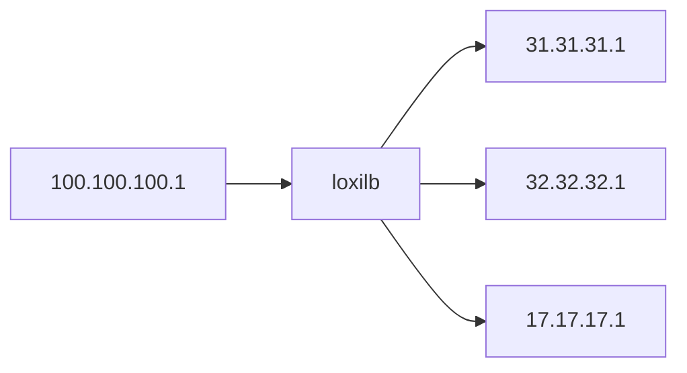

# Creating a simple test topology for loxilb

To test loxilb in a completely virtual environment, it is possible to quickly create a virtual test topology. We will explain the steps required to create a very simple topology (more complex topologies can be built using this example) :




Prequesities :
* The system should be x86 based (bare-metal or virtual)
* Docker should be preinstalled
* Pull and run loxilb docker 
```
# docker pull loxilbio/loxilb:beta
# docker run -u root --cap-add SYS_ADMIN   --restart unless-stopped --privileged -dit -v /dev/log:/dev/log --name loxilb loxilbio/loxilb:beta
```

Next step is to run the following script to create and configure the above topology :

```
#!/bin/bash

docker=$1
HADD="sudo ip netns add "
LBHCMD="sudo ip netns exec loxilb "
HCMD="sudo ip netns exec "

id=`docker ps -f name=loxilb | cut  -d " "  -f 1 | grep -iv  "CONTAINER"`
echo $id
pid=`docker inspect -f '{{.State.Pid}}' $id`
if [ ! -f /var/run/netns/loxilb ]; then
  sudo touch /var/run/netns/loxilb
  sudo mount -o bind /proc/$pid/ns/net /var/run/netns/loxilb
fi

$HADD l3e1
$HADD l3e2
$HADD l3e3
$HADD l3c1

## Configure load-balancer end-point l3e1
sudo ip -n loxilb link add enp1 type veth peer name eth0 netns l3e1
sudo ip -n loxilb link set enp1 mtu 9000 up
sudo ip -n l3e1 link set eth0 mtu 7000 up
$LBHCMD ip addr add 31.31.31.254/24 dev enp1
$HCMD l3e1 ifconfig eth0 31.31.31.1/24 up
$HCMD l3e1 ip route add default via 31.31.31.254


## Configure load-balancer end-point l3e2
sudo ip -n loxilb link add enp2 type veth peer name eth0 netns l3e2
sudo ip -n loxilb link set enp2 mtu 9000 up
sudo ip -n l3e2 link set eth0 mtu 7000 up
$LBHCMD ip addr add 31.31.31.254/24 dev enp2
$HCMD l3e2 ifconfig eth0 31.31.31.1/24 up
$HCMD l3e2 ip route add default via 31.31.31.254

## Configure load-balancer end-point l3e3
sudo ip -n loxilb link add enp3 type veth peer name eth0 netns l3e3
sudo ip -n loxilb link set enp3 mtu 9000 up
sudo ip -n l3e3 link set eth0 mtu 7000 up
$LBHCMD ip addr add 17.17.17.254/24 dev enp3
$HCMD l3e3 ifconfig eth0 17.17.17.1/24 up
$HCMD l3e3 ip route add default via 17.17.17.254

## Configure load-balancer end-point l3c1
sudo ip -n loxilb link add enp4 type veth peer name eth0 netns l3c1
sudo ip -n loxilb link set enp4 mtu 9000 up
sudo ip -n l3c1 link set eth0 mtu 7000 up
$LBHCMD ip addr add 100.100.100.254/24 dev enp4
$HCMD l3c1 ifconfig eth0 100.100.100.1/24 up
$HCMD l3c1 ip route add default via 100.100.100.254
```

Finally, we need to configure load-balancer rule inside loxilb docker as follows :
```
docker exec -it loxilb bash
root@8b74b5ddc4d2:/# loxicmd create lb 20.20.20.1 --tcp=2020:5001 --endpoints=31.31.31.1:1,32.32.32.1:1,17.17.17.1:1
```

So, we now have loxilb running as a docker with 4 hosts connected to it. 3 of the hosts act as load-balancer arms and 1 of them act as a client. We can run any workloads as we which inside the host containers and start testing loxilb


